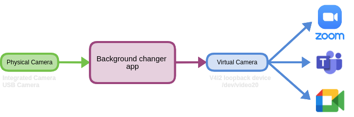

# MS Teams background changer

Microsoft Teams on linux operating system does not have background effects like background blur or custom background image. This utility application enables these missing features to blur and add custom background image. It works on other video conference platform as well like Zoom, Google Meet and Skype. 

We have used AI based image segmentation model [DeepLab-V3](https://ai.googleblog.com/2018/03/semantic-image-segmentation-with.html) to segment person as foreground and the rest of the objects as a background and apply filters to it.




## Installation

### Install dependencies

    sudo apt-get install v4l2loopback-dkms v4l-utils

[v4l2loopback](https://github.com/umlaeute/v4l2loopback) module is used to create **virtual video devices**. Therefore, all v4l2 applications will read the newly created virtual video device as a physical video device. This allows us to push modified video stream to the virtual camera and use it as a normal video feed coming from a physical camera device.  

### Install requirements

-   Python 3.x

Install python dependencies using

    pip3 install -r requirements.txt

## Usage

### 1.Create Virtual Camera

    sudo modprobe v4l2loopback video_nr=20 card_name="Virtual Camera 1" exclusive_caps=1


This will create a virtual camera with a device ID 20 and with a name **Virtual Camera 1**. If it's taken, change to different ID. Recommended to give higher number therefore there won't be a clash with other devices.

You can verify that by running

    ls -1 /sys/devices/virtual/video4linux
and this should output something like ``` video20 ```.  

### 2.Verify Virtual camera 

Debug the list of physical and virtual camera using the command

    v4l2-ctl --list-devices

And that will pop out information about all the integrated, connected(usb) and virtual camera along will associated device ID currently connected to the PC.

``` 
Virtual Camera 1 (platform:v4l2loopback-000):
	/dev/video20

Lenovo FHD Webcam Audio: Lenovo (usb-0000:00:14.0-4):
	/dev/video2
	/dev/video3

Integrated Camera: Integrated C (usb-0000:00:14.0-7):
	/dev/video0
	/dev/video1
```

### 3.Update Configurations

Edit configuration data in ```config.yaml``` file.

```
[V4L2]
# add virtual camera device ID
virtualDeviceID = /dev/video20 
```

Edit the input cameraID from which the realtime video stream should be fetched.

```
[stream]
# change input camera device ID 
CameraID = /dev/video2
```

edit the background settings in the configuration file.

```
[background]
# if blur = yes, only background will be blurred, background image is not added
# if blur = no, custom background image is added, blur effect is not applied
# blur_intensity should always be an odd number
blur = yes
blur_intensity = 11
image = images/workspace.jpg
```

### 4.Run application

Now we are ready to run the application,

    python3 main.py

This should start to read the video feed from the input video camera, apply effects and push it to the Virtual camera. You can press ```ctrl+q``` to stop the application.
